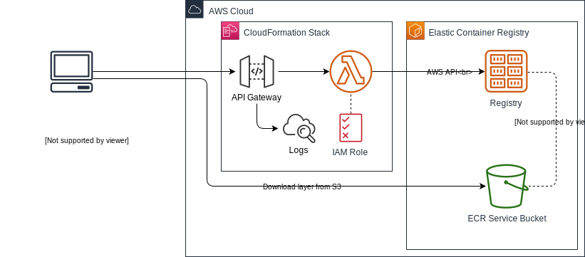

# Public Proxy for AWS ECR

Host any Elastic Container Registry (ECR) publicly on a custom domain using this serverless proxy.

## Solution Overview

ECR doesn't support [public registries](https://aws.amazon.com/ecr/faqs/). Instead, the docker client needs to authenticate with ECR using AWS IAM credentials which requires the AWS CLI or an SDK that can generate those credentials.

If you would like to make your registries publicly available then this solution can help. It deploys an API Gateway and a Lambda function that act as a proxy for AWS ECR.

